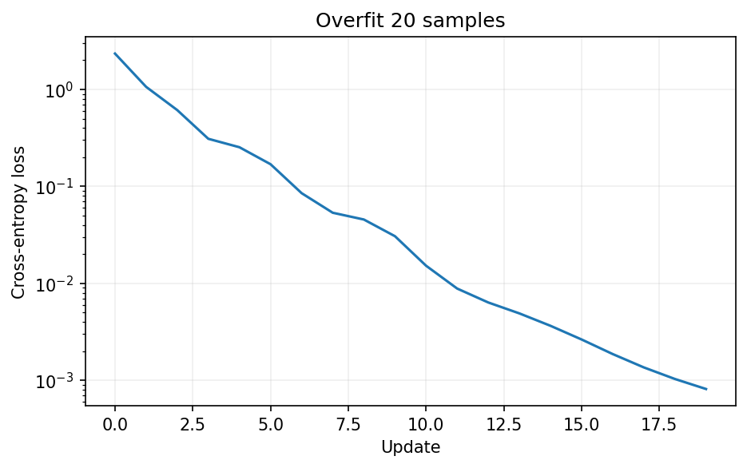
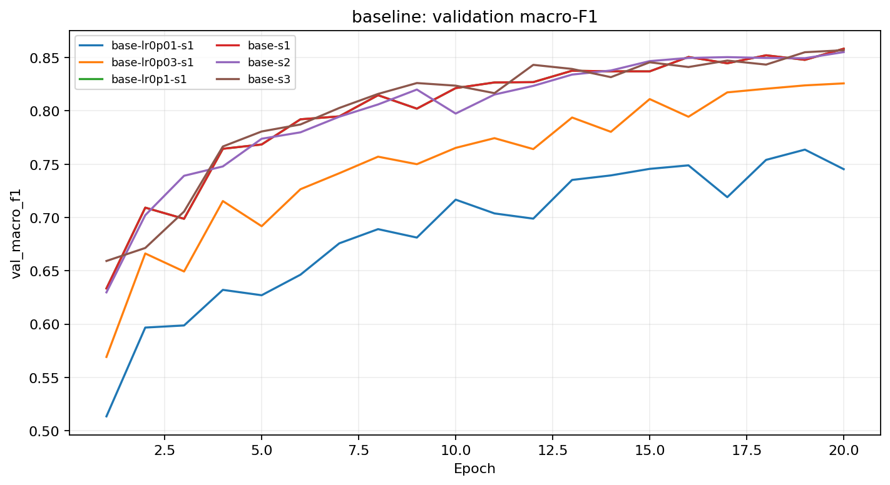
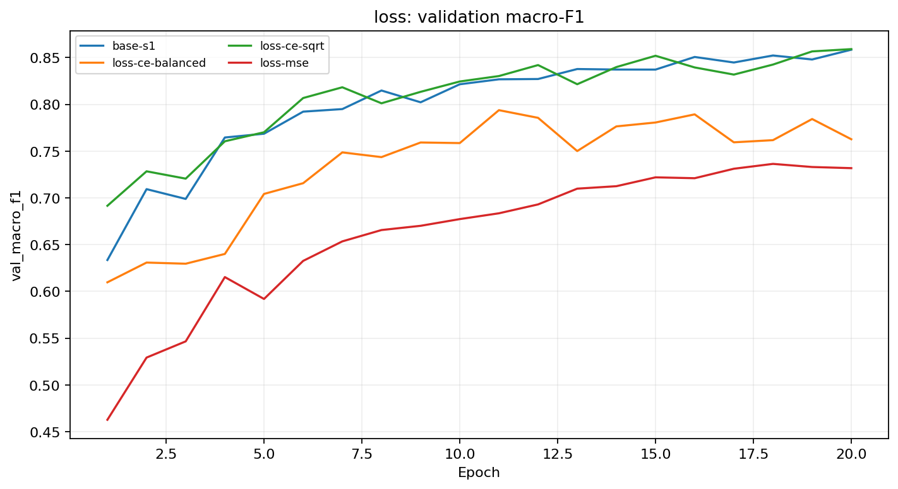
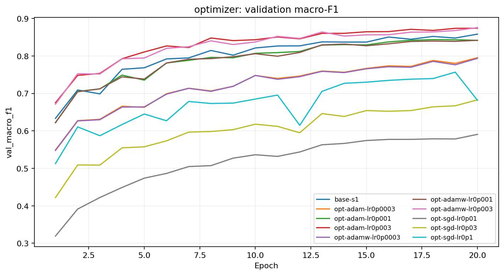
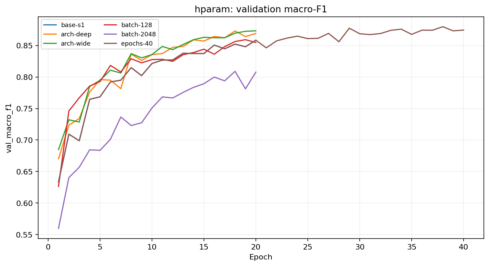
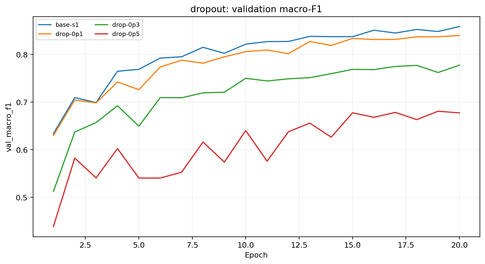
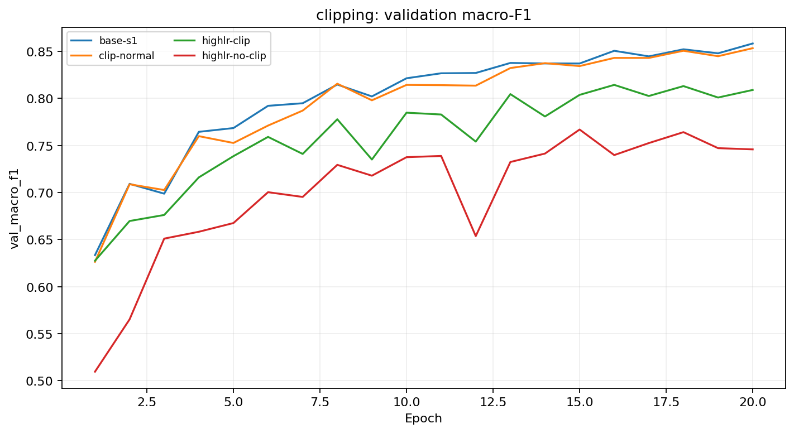
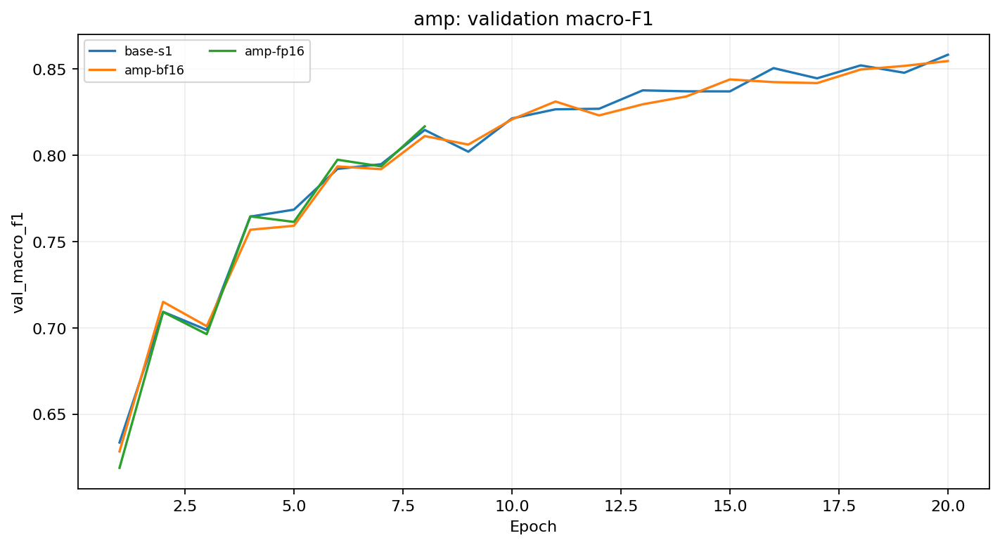
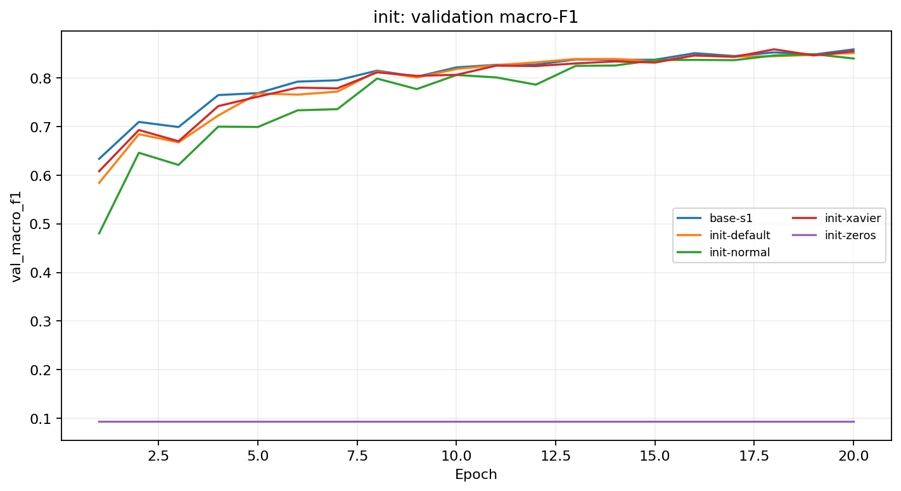
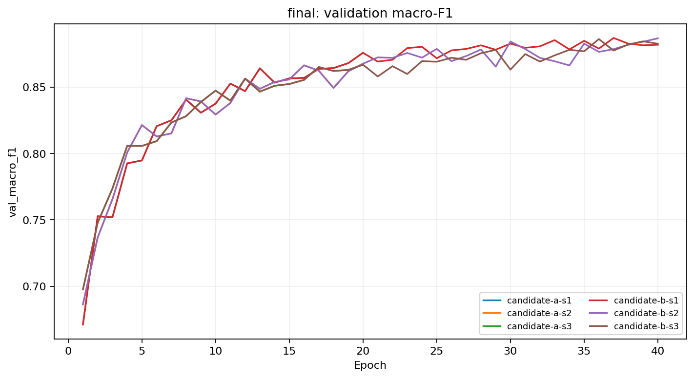

# Báo cáo Lab Day 1 — Lê Nguyễn Trâm Anh — 2A202602760

## 1. Thiết lập và nguyên tắc chọn mô hình

Bài toán Forest CoverType có 54 đặc trưng và 7 lớp, phân bố không cân bằng. Tôi dùng đúng `split_metadata.csv`: 464.809 mẫu train và 116.203 mẫu eval. Từ train, tôi tách validation 20% theo lớp, seed 42, thành 371.847 train và 92.962 val. Mean và độ lệch chuẩn của 10 cột liên tục chỉ được tính trên phần train này; 44 cột one-hot giữ nguyên. Eval chỉ được dự đoán sau khi đã khóa lựa chọn bằng val. Chỉ số chọn mô hình là **macro-F1** vì chiến lược luôn đoán lớp 1 đạt accuracy khoảng 0,4876 nhưng macro-F1 chỉ khoảng 0,094.

Baseline M-base: `54→256→128→7`, ReLU, He initialization, cross-entropy (CE), SGD momentum 0,9, batch 512, 20 epoch, FP32, không dropout/clip/weight decay. Dò `lr={0.01,0.03,0.1}` trên val cho macro-F1 lần lượt `0.7637, 0.8258, 0.8584` (`base-lr0p01-s1`, `base-lr0p03-s1`, `base-lr0p1-s1`), nên chọn lr 0,1. Mọi run so sánh dùng cùng split và seed 1, trừ khi chính seed hoặc số epoch là biến đang thử. Metric được ghi tại epoch có **val loss thấp nhất**.

## 2. Kiểm tra pipeline và nhiễu seed

| Phép kiểm tra | Kết quả đo |
|---|---:|
| Số tham số / shape logits | 47.879 / `(8,7)` |
| CE bước 0 trên val / `ln 7` | 2,3776 / 1,9459 (health check seed 42) |
| Probe riêng: nhân trọng số lớp logits cuối 0,1 / logits đều | 1,9704 / 1,9459 |
| Quá khớp 20 mẫu | loss 0,000813, accuracy 100% sau 20 update |
| Gradient của 6 tensor tham số | đều khác None và khác 0 |
| Baseline val macro-F1, 3 seed | **0,8562 ± 0,0019** |
| Baseline val accuracy, 3 seed | 0,9091 ± 0,0007 |
| Ngưỡng tham khảo `2σ` macro-F1 | **0,0037** |



Loss bước 0 của health check **không gần** `ln 7`; `base-s1` cũng là 2,2691. He initialization trên cả lớp ra tạo logits có độ phân tán ban đầu (độ lệch chuẩn lớp ra 0,5759 ở `base-s1`), nên điểm số lớp không đồng đều và CE có thể cao hơn mốc logits đều. Điều này là một tín hiệu cần kiểm tra, không thể tự coi là “đạt kiểm tra ln 7”. Tuy nhiên shape/tham số/gradient đều đúng và phép thử overfit 20 mẫu thành công, nên không có bằng chứng pipeline bị đứt. Khởi tạo zeros cho loss 1,9459 đúng mốc nhưng lại **không học được**; chỉ riêng loss bước 0 đẹp không chứng minh mạng khỏe.

Sau khi khóa cấu hình và eval, tôi chạy **một probe chẩn đoán độc lập**, không huấn luyện và không dùng để lựa chọn mô hình (`step0_diagnostic.json`, cell sau Stage 1). Nó tái hiện đúng loss He gốc 2,37757; chỉ nhân trọng số lớp logits cuối với 0,1 đã đưa CE về 1,97044, còn logits đều cho 1,94591 ≈ `ln 7`. Đây là bằng chứng trực tiếp rằng biên độ lớp ra giải thích phần lớn chênh lệch. **Không** thay khởi tạo của các run đã báo cáo, không ghi đè checkpoint/prediction, và không dùng con số 1,94591 làm loss bước 0 của baseline.

Ba baseline `base-s1/s2/s3` cho val macro-F1 lần lượt 0,8584/0,8552/0,8551. Trong phần dưới, tôi chỉ gọi khác biệt là có bằng chứng khi nó vượt 0,0037; đây là ngưỡng tham khảo từ **baseline trên val**, không phải phép kiểm định ý nghĩa thống kê cho mọi cấu hình.



## 3. Bảy chủ đề thực nghiệm

### 3.1 Hàm mất mát

**Dự đoán trước:** CE sẽ học nhanh và ổn định hơn MSE một-hot; tăng trọng số lớp hiếm có thể giúp macro-F1 nhưng cũng có thể giảm accuracy.

So theo metric, không so độ lớn loss khác thang đo: `loss-mse` đạt val macro-F1 **0,7329**, CE baseline `base-s1` **0,8584**. CE trọng số nghịch tần suất `loss-ce-balanced` đạt 0,7842, còn trọng số căn nghịch tần suất `loss-ce-sqrt` đạt 0,8590. Chênh +0,0006 của `loss-ce-sqrt` so với baseline **nhỏ hơn 2σ**; chưa thể kết luận nó tốt hơn. Cân bằng đầy đủ đã làm kết quả tổng thể kém đi. CE dùng gradient từ phân phối logits; MSE ở đây đo sai khác giữa **logits thô** và one-hot, có thang và hướng tối ưu khác. Trọng số lớn cho lớp hiếm thay đổi mục tiêu tối ưu; chưa có bảng F1 từng lớp trên val cho các run này nên không khẳng định lớp hiếm nào đã cải thiện.



### 3.2 Bộ tối ưu

**Dự đoán trước:** Adam/AdamW có thể tiến nhanh hơn ở lưới lr phù hợp; so cùng một lr giữa SGD và Adam không đủ công bằng.

| Bộ tối ưu, lr tốt nhất trong lưới đã chạy | `exp_id` | Val macro-F1 | Best epoch |
|---|---|---:|---:|
| SGD, 0,1 | `opt-sgd-lr0p1` | 0,7397 | 18 |
| SGD momentum, 0,1 | `base-s1` | 0,8584 | 20 |
| Adam, 0,003 | `opt-adam-lr0p003` | 0,8683 | 18 |
| AdamW, 0,003 | `opt-adamw-lr0p003` | **0,8757** | 20 |

SGD và SGD momentum được dò `0.01/0.03/0.1`; Adam và AdamW được dò `0.0003/0.001/0.003`. AdamW hơn baseline +0,0174, vượt 2σ. Momentum tích lũy hướng gradient, còn Adam dùng moment bậc một và hai để điều chỉnh bước theo tham số. **Giới hạn thiết kế:** AdamW dùng weight decay 0,01, Adam dùng 0; vì vậy chênh 0,0074 giữa `opt-adamw-lr0p003` và `opt-adam-lr0p003` không tách riêng được tác dụng thuật toán khỏi weight decay. Cũng không thể khẳng định lr đã tối ưu ngoài lưới thử.



### 3.3 Batch, kiến trúc và thời gian huấn luyện

**Dự đoán trước:** batch 2048 có ít update hơn mỗi epoch; mạng rộng/sâu và thêm epoch có thể cải thiện nếu baseline chưa hội tụ.

`batch-128` đạt 0,8563 (gần `base-s1` 0,8584), còn `batch-2048` đạt 0,8090. Cùng 20 epoch, số update khác nhau nên đây không chỉ là hiệu ứng phương sai gradient; run batch lớn cũng giữ lr 0,1 và chưa được dò lr riêng. `arch-wide` đạt 0,8725, `arch-deep` 0,8691; cả hai hơn baseline vượt 2σ nhưng tốn thêm tham số, nên chưa chọn chỉ theo một seed. `epochs-40` đạt 0,8743, best epoch 36, cho thấy baseline 20 epoch còn khả năng cải thiện. Với batch 512, 20 epoch có 14.540 update, 40 epoch có 29.080 update.



### 3.4 Dropout

**Dự đoán trước:** nếu chưa quá khớp mạnh, dropout sẽ làm giảm năng lực học.

Ở `base-s1`, train loss cuối 0,2063 và val loss 0,2314: khoảng cách có nhưng nhỏ. Dropout `q=0.1/0.3/0.5` cho val macro-F1 `0.8368/0.7769/0.6630` (`drop-0p1/0p3/0p5`), đều thấp hơn baseline nhiều hơn 2σ. Kết quả phù hợp dự đoán: regularization gây underfit lớn hơn phần lợi từ giảm overfit trong 20 epoch. Train loss được đo ở `eval()` mode nên có thể so với val loss khi dropout đã tắt.



### 3.5 Cắt gradient

**Dự đoán trước:** cắt gradient ở lr thường có thể làm chậm học; ở lr cao có thể giảm dao động.

Từ `base-s1`, percentile 75 của grad norm **trước clip** là 0,6289; tôi dùng giá trị đó làm ngưỡng `c`. Ở `clip-normal`, clipping kích hoạt khoảng **31,4%** update nhưng val macro-F1 giảm từ 0,8584 xuống 0,8507 (vượt 2σ). Khi tăng lr gấp 10, `highlr-no-clip` đạt 0,7670; `highlr-clip` đạt 0,8026, cải thiện 0,0356. Tuy nhiên clip chỉ kích hoạt **0,15%** update trong run lr cao và run vẫn kém baseline. Vì vậy quan sát hỗ trợ khả năng clip chặn một số spike, **không chứng minh clipping đã “cứu” được cấu hình lr cao**. Chỉ số grad norm được ghi trước khi cắt.



### 3.6 Mixed precision

**Dự đoán trước:** FP16/BF16 có thể tiết kiệm bộ nhớ hoặc thời gian, nhưng mạng nhỏ có thể bị overhead kernel chi phối.

FP32 `base-s1` dùng **1,332 giây/epoch cập nhật**, peak memory **160,1 MB**. `amp-bf16` chạy đủ 20 epoch, **1,652 giây/epoch**, peak **160,1 MB**, val macro-F1 0,8547; chênh -0,0036 so với baseline không vượt 2σ. Trên phép đo này BF16 **không nhanh hơn và không giảm peak memory ghi nhận**. `amp-fp16` mất **1,920 giây/epoch** trong các epoch hoàn tất, rồi **diverged ở epoch 8**; val macro-F1 0,8168 là metric tại best epoch trước khi dừng, **không phải kết quả đủ 20 epoch**. Code phát hiện giá trị loss/grad không hữu hạn nhưng log không phân biệt được overflow, underflow hay nguyên nhân khác, nên không quy kết chắc chắn. FP16 cần GradScaler để giảm nguy cơ gradient nhỏ bị underflow; việc dùng scaler vẫn không đảm bảo run này ổn định.



### 3.7 Khởi tạo tham số

**Dự đoán trước:** zeros sẽ phá tính bất đối xứng; normal nhỏ làm kích hoạt co lại; He và Xavier có thể gần nhau trên MLP hai lớp ẩn.

| Init | `exp_id` | Std kích hoạt qua hai ReLU rồi logits ở bước 0 | Val macro-F1 |
|---|---|---|---:|
| zeros | `init-zeros` | 0 / 0 / 0 | 0,0936 |
| normal 0,01 | `init-normal` | 0,0203 / 0,0022 / 0,0003 | 0,8485 |
| Xavier | `init-xavier` | 0,1630 / 0,1248 / 0,1911 | 0,8585 |
| He baseline | `base-s1` | 0,3904 / 0,3661 / 0,5759 | 0,8584 |

`init-zeros` gần mức đoán lớp đa số, dù CE bước 0 đúng `ln7`; các neuron cùng lớp nhận gradient đối xứng và ReLU tại 0 làm mạng không học biểu diễn hữu ích. Normal nhỏ làm tín hiệu co rõ qua tầng. Xavier và He khác val macro-F1 chỉ **0,0002 < 2σ**, nên chưa thể nói cách nào thắng trên mạng nông này. He giữ phương sai qua ReLU tốt hơn về mặt lý thuyết, nhưng logits ban đầu của run này cũng làm CE bước 0 lệch mốc.



## 4. Chọn cấu hình cuối bằng validation; eval chỉ để báo cáo

Candidate A và B được chạy ba seed sau các thử nghiệm một yếu tố. Mean val macro-F1: A **0,8684 ± 0,0069**, B **0,8846 ± 0,0024**. Chênh **0,0162** vượt ngưỡng tham khảo 0,0037; B cũng ít dao động hơn. Quy tắc chọn đã được lưu trong `selection_state.json` trước khi chạy eval. B giữ M-base, dùng CE, AdamW lr 0,003, weight decay 0,01, batch 512, He, 40 epoch, không dropout/clip; file nộp là **seed 1** (`candidate-b-s1`), được chọn theo quy tắc trước chứ không chọn seed nhờ điểm eval.



| Cấu hình | Val macro-F1 seed 1 | Eval macro-F1 | Eval accuracy |
|---|---:|---:|---:|
| Baseline `base-s1` | 0,8584 | 0,8618 | 0,9064 |
| Cuối `candidate-b-s1` | 0,8853 | **0,8860** | **0,9227** |

Eval macro-F1 tăng **0,0242** so với baseline seed 1. Trên val, mean B hơn mean baseline 0,0284, lớn hơn 2σ baseline. Đây là bằng chứng cải thiện ổn định qua seed **trên val**; tôi không đo độ lệch chuẩn eval qua seed nên không tuyên bố một ngưỡng nhiễu eval riêng. Val và eval của seed nộp gần nhau (0,8853 và 0,8860), phù hợp việc validation tách phân tầng từ train.

### 4.1 Phân tích lỗi theo lớp của cấu hình cuối

| Lớp | Support | Precision | Recall | F1 |
|---:|---:|---:|---:|---:|
| 0 | 42.368 | 0,9148 | 0,9212 | 0,9180 |
| 1 | 56.661 | 0,9338 | 0,9336 | 0,9337 |
| 2 | 7.151 | 0,9108 | 0,9406 | 0,9254 |
| 3 | 549 | 0,8989 | 0,7614 | 0,8245 |
| 4 | 1.899 | 0,8519 | 0,7783 | **0,8134** |
| 5 | 3.473 | 0,8779 | 0,8362 | 0,8565 |
| 6 | 4.102 | 0,9432 | 0,9183 | 0,9306 |

Lớp **4 (Aspen)** khó nhất: F1 0,8134; trong 1.899 mẫu, có **345** mẫu bị đoán thành lớp **1 (Lodgepole Pine)**. Lớp 4 chỉ chiếm khoảng 1,6% dữ liệu, so với 48,8% của lớp 1. Mất cân bằng là một lý do hợp lý, còn mức chồng lấn đặc trưng địa hình giữa hai lớp là **giả thuyết chưa đo trực tiếp**. CE trọng số đầy đủ đã làm giảm macro-F1 tổng thể (`loss-ce-balanced`), nên hướng tiếp theo là xem đặc trưng và lỗi theo lớp trên val, thử trọng số nhẹ hơn hoặc lấy mẫu có kiểm soát; không điều chỉnh sau khi nhìn eval.

```text
Ma trận nhầm lẫn (hàng = nhãn thật; cột = dự đoán 0..6)
39029 3100    1   0   27   9  202
 3280 52899 142   0  206 109   25
    7  138 6726  28   18 234    0
    0    0   94 418    0  37    0
   40  345   21   0 1478  15    0
   10  134  401  19    5 2904   0
  299   35    0   0    1   0 3767
```

## 5. Khi loss không giảm sau 2.000 bước: ba phép thử đầu tiên

1. **Dữ liệu, nhãn và bước 0:** xác nhận nhãn 0..6, input 54 chiều, 10 cột số đã chuẩn hóa bằng train, logits chưa softmax và loss tính đúng. So CE bước 0 với `ln7`, đồng thời xem phân bố/độ lệch chuẩn logits; chính run He của tôi cho thấy lệch mốc cần được giải thích.
2. **Overfit 20 mẫu:** nếu cùng model không đưa loss của 20 mẫu về gần 0, kiểm tra forward, optimizer có nhận đúng tham số, `zero_grad`, backward và bước cập nhật. Phép thử của tôi đạt 0,000813/100%.
3. **Dòng gradient và learning rate:** xem từng tensor gradient có None/0/NaN không, ghi global norm **trước clip**, quan sát train/val loss. Norm tăng vọt hoặc không hữu hạn gợi ý lr/precision; gradient không chảy gợi ý graph/activation. Sau đó mới thay đổi kiến trúc hay kỹ thuật regularization.

## 6. Giới hạn và tính tái lập

Phần lớn run thăm dò chỉ có seed 1; ba seed được dùng cho baseline và hai candidate. Lưới lr hữu hạn, AdamW khác Adam cả weight decay, và batch cùng số epoch có số update khác nhau. FP16 diverged, còn thời gian/peak memory của AMP chỉ phản ánh Tesla T4 và cấu hình đo này; `time_per_epoch_s` trong JSON đo vòng **huấn luyện**, chưa tính đánh giá và lưu ảnh. Việc best epoch được chọn bằng **val loss** khiến macro-F1 báo cáo không nhất thiết là giá trị cao nhất trên cả đường cong. Những sai khác dưới 2σ được giữ là “chưa kết luận”; không có thay đổi mô hình nào sau khi thấy eval.

Bài nộp có toàn bộ code và notebook đã lưu output trong `code/`, 41 JSON trong `results/`, một ảnh riêng cho mỗi `exp_id`, ảnh so sánh, `experiments.xlsx`, `predictions_eval.csv` và `eval_result.json`. Các số eval lấy từ script chấm chính thức; các số val truy về `exp_id` trong Excel/JSON.
